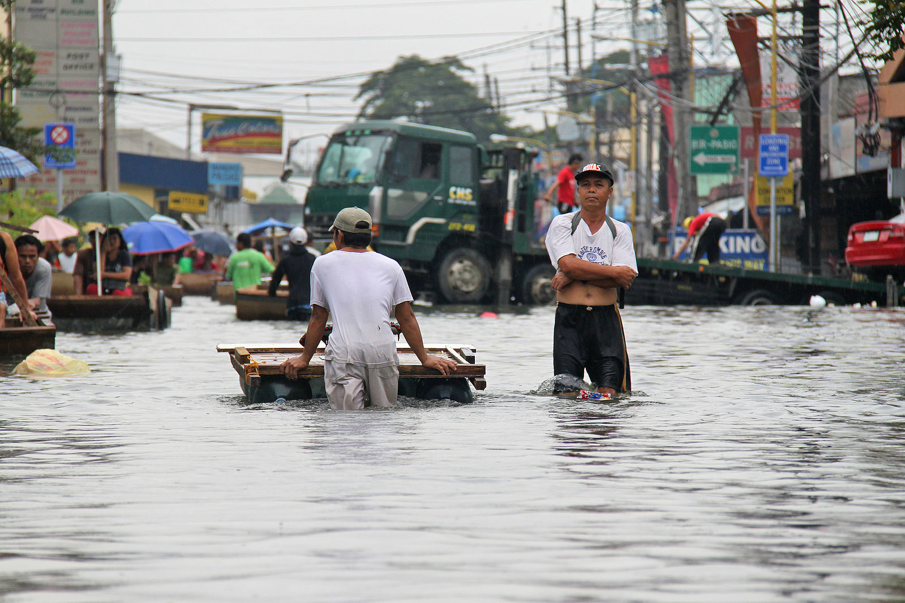

# EDS296 Final

## Exploring Precipitation and Temperature Patterns in South East Asia 

**Marina Kochuten, Jordan Sibley, and Josephine Cardelle**

Spring 2025

*Typhoon Ondoy, Philippines (2009). Source: [Wikimedia Commons](https://commons.wikimedia.org/wiki/File:Flooding_from_Typhoon_Ondoy_%28Ketsana%29,_Philippines_2009._Photo-_AusAID_%2810695830893%29.jpg)*

## Overview 

This project explores projected changes in temperature and precipitation across Southeast Asia under a high-emissions climate scenario. Using data from two CMIP6 Earth System Models—CMCC-ESM2 and CanESM5—we analyze long-term climate patterns to assess how conditions may shift from a historical baseline period (1975–2025) to a future projection period (2026–2075).

The region of focus includes countries such as Indonesia, Thailand, Vietnam, the Philippines, Malaysia, and Cambodia, which are nations highly vulnerable to climate-driven hazards, including typhoons, sea-level rise, and extreme heat.

## Data and Dependecies

Data is accessed via the [Pangeo CMIP6 Cloud Data Catalog](https://pangeo-data.github.io/pangeo-cmip6-cloud/), with analyses performed on the following models and scenarios:

**Models**:

- [CMCC-ESM2](https://www.cmcc.it/models/cmcc-esm-earth-system-model)
- [CanESM5](https://gmd.copernicus.org/articles/12/4823/2019/)

**Scenario**: [SSP5-8.5](https://www.dkrz.de/en/communication/climate-simulations/cmip6-en/the-ssp-scenarios) – a high-emissions pathway with minimal climate mitigation.

This analysis relies on the following Python libraries:

- `xarray`
- `intake`
- `matplotlib`
- `cartopy`
- `numpy`

## Acknowledgments 

This repository is for academic use as part of the [UCSB Bren School’s EDS296 course](https://bren.ucsb.edu/courses/eds-296-1s), A Climate Modeling Perspective on Big Data Techniques. Data is sourced from publicly available CMIP6 climate model archives.
